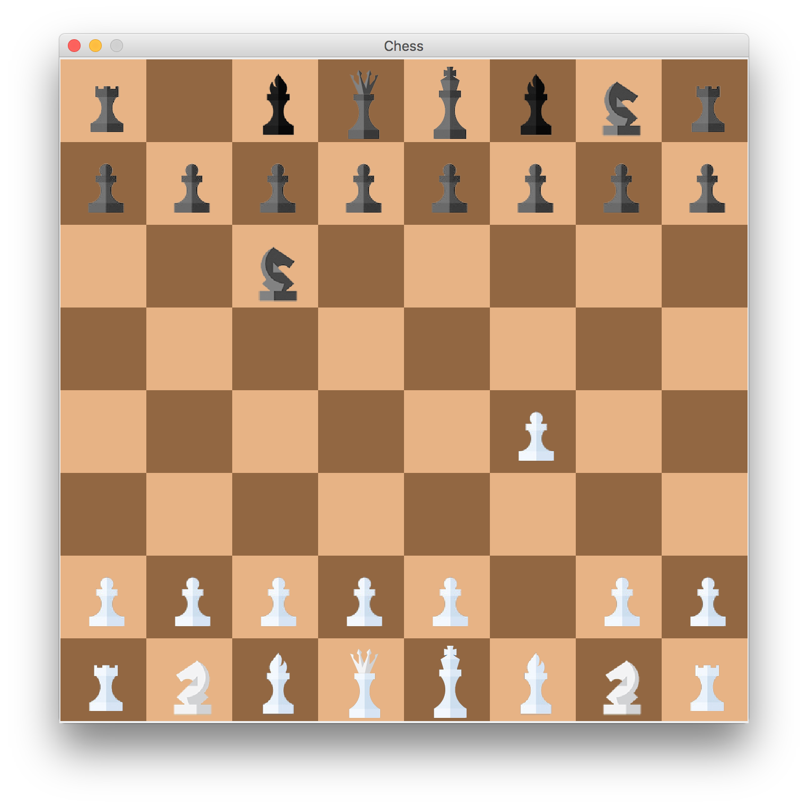

# Chess Project



<div align="center">
  <a href="https://travis-ci.com/fzxt/Chess">
  
</a>
</div>

## Prerequisites

- You'll need Java 8 installed on your machine
- If you wish to run the unit tests (in `tests/` directory), you'll need JUnit 5

## About

AI vs Human 2D Chess written in Java with Swing. AI based on Alpha Beta Pruning

## Notes

- This game does not support loading custom boards.

## Gameplay

- AI is Team Black, User is Team White
- User (White) goes first

### Moving

- To show available moves, click the piece you wish to move when it's your turn
- Then click where you want to move the tile
- Normal moves are blue, Attack moves are red, special moves are yellow.
- If someone is in check, their king will be highlighted orange.

### Gameover

- When the game is over, a dark overlay will show on the screen and the winner is printed to the console

## Compiling, running

- There are two primary routes, with IDE and with command line.

## With IDE

- You'll need to import the project in your editor
- Right click `src/com/company/Game.java`, and run the file.

## With Command line

### Building

#### macOS and Linux

- In your terminal, navigate to the root of the project (location of this readme)
- Enter the following commands in order:

```sh
$ mkdir bin
$ javac -d bin -sourcepath src/ src/com/company/Game.java
```

#### Windows

- Open the command prompt, and navigate to the location of this README
- Enter the following commands:

```sh
$ md bin
$ javac -d bin -sourcepath src/ src/com/company/Game.java
```

### Running (macOS, Linux, Windows)

- Once the project has been built, navigate to the location of this README in your terminal
- Enter the following in your terminal / command prompt:

```sh
$ java -cp bin/ com.company.Game
```

## Credits
- I did not make any assets for the game, they are not mine. Unfortunately, I do not remember where I got them. I believe I googled something like "Flat design chess piece set". If you know the original author, please let me know so I can amend it.
